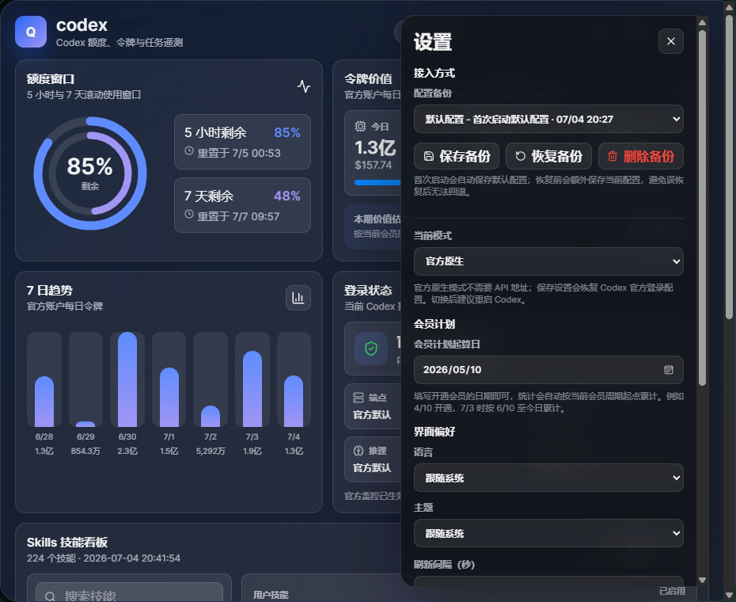
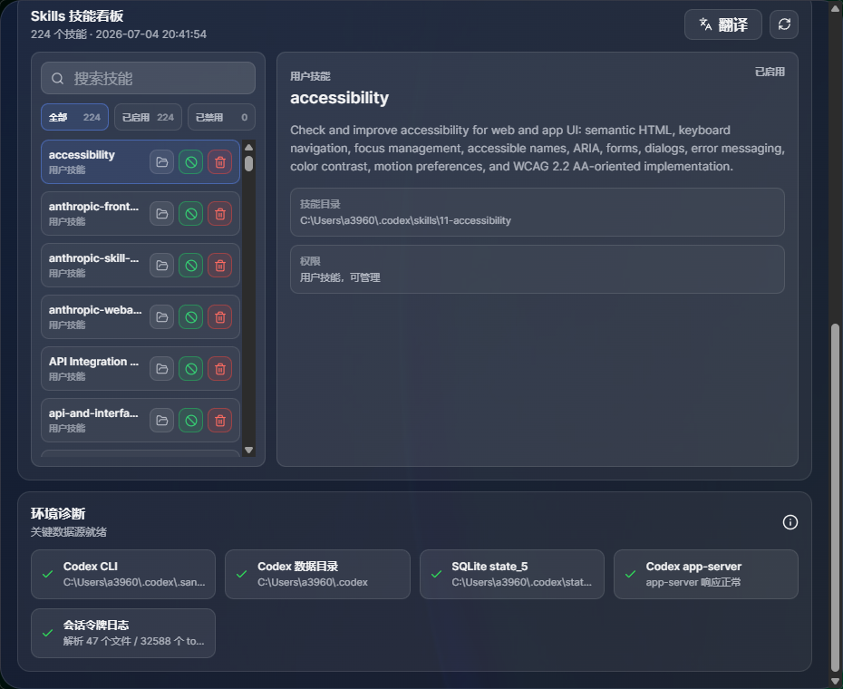

# codex-PAISHU

[English](#english) | [中文](#中文)


## 中文

`codex-PAISHU` 是一个开源的跨平台 Codex 桌面仪表盘，用于查看本机 Codex / ChatGPT Codex 的额度窗口、令牌用量、价值估算、登录状态、Skills 技能看板和运行环境诊断。

它同时支持官方原生登录和第三方 API / API 中转模式。你可以在设置里一键切换接入方式，自动写入 Codex `config.toml` 与 `auth.json`，并通过内置备份功能恢复到首次启动时的默认配置。

> 本项目是社区工具，非 OpenAI 官方产品。

### 核心功能

- **额度窗口监控**：展示 5 小时 / 7 天滚动额度窗口和重置时间。
- **令牌价值估算**：按官方 API 价格估算今日、近 7 天、累计和当前会员周期价值。
- **官方原生 / 第三方 API 一键切换**：在设置页选择 `官方原生` 或 `API 中转`，自动同步 Codex 配置。
- **API 中转配置**：支持 API 地址、API Key、模型名、推理强度、速度策略。
- **配置备份与恢复**：首次启动自动保存默认配置；可手动保存、恢复、删除非默认备份。
- **Skills 技能看板**：浏览本机 Codex Skills，支持搜索、翻译描述、启用 / 禁用 / 归档用户技能。
- **环境诊断**：检查 Codex CLI、数据目录、SQLite state、app-server、会话日志解析状态。
- **本地优先**：SQLite、JSONL、配置同步等敏感操作都在本机 Rust 侧完成。
- **跨平台桌面**：Tauri 2 + React + Rust，面向 Windows 和 macOS。

### 第三方 API / API 中转

设置页可以把 Codex 从官方原生模式切换到 API 中转模式：



保存后会同步：

- `model_provider = "paishu_relay"`
- `[model_providers.paishu_relay]`
- `base_url`
- `wire_api = "responses"`
- `preferred_auth_method = "apikey"`
- 模型、推理强度、速度策略
- `auth.json` 中的 `auth_mode` 与 `OPENAI_API_KEY`

切回官方原生模式时，会移除PAISHU中转 provider 形态并恢复 ChatGPT 官方登录配置，同时保留项目路径、MCP servers、trust records 等无关配置段。

### 配置备份

为了防止修改 Codex 配置时误伤其他参数，应用会在首次启动时自动创建 `default-initial` 默认备份。你也可以在设置页：

- 保存当前配置备份
- 从下拉框选择并恢复备份
- 删除非默认备份

恢复备份前会额外保存当前配置，因此误恢复后仍有回退路径。

### Skills 技能看板



技能看板只读取 bounded metadata，不把完整 `SKILL.md` 内容发送到前端。系统技能、插件缓存技能、受保护技能默认为只读；用户技能可以启用、禁用或归档。

### 数据来源

- `codex app-server` JSON-RPC：
  - `account/read`
  - `account/rateLimits/read`
  - `account/usage/read`
- 本机 Codex SQLite：
  - Windows: `%USERPROFILE%\.codex\state_5.sqlite`
  - macOS: `~/.codex/state_5.sqlite`
  - fallback: `.codex/sqlite/state_5.sqlite`
- 会话日志：
  - `.codex/sessions/**/rollout-*.jsonl`
- 自动化配置：
  - `.codex/automations/**/automation.toml`

### 安装与使用

从 [Releases](https://github.com/PAISHU-AI/codex-PAISHU-source/releases) 下载安装包，或从源码运行。

桌面快捷键：

- Windows: `Ctrl+Alt+U`
- macOS: `Command+U`

托盘菜单：

- 显示 / 隐藏
- 切换窗口置顶
- 退出

### 从源码开发

环境要求：

- Node.js 24+
- Rust 1.92+
- Windows 或 macOS
- Windows 打包需要 Microsoft WebView2 Runtime。
- macOS 打包需要 Xcode Command Line Tools。
- Windows `.exe` 建议在 Windows 主机打包；macOS 交叉打包可用，但需要额外安装 NSIS、LLVM、`cargo-xwin` 和 `x86_64-pc-windows-msvc` target，且 Tauri 对跨平台编译仍标记为 experimental。

```powershell
npm install
npm run dev
```

前端预览：

```powershell
npm run dev:frontend
```

验证：

```powershell
npm run lint
npm run test -- --run
npm run build
npm run rust:check
npm run rust:test
```

打包：

```powershell
npm run build
npm run rust:check
npm run tauri build
```

macOS / Windows 产物位于：

```text
src-tauri/target/release/bundle/
```

### 技术栈

- Tauri 2
- React 19
- TypeScript
- Vite
- Rust
- SQLite / `rusqlite`
- `toml_edit` / `serde_json`
- Tauri tray and global shortcut

### 安全边界

- 前端不直接读取任意本地文件。
- Codex 配置、认证文件、SQLite、JSONL 读取都在 Rust 命令中处理。
- API Key 不写入应用自己的 `settings.json`。
- README 和 UI 不展示原始密钥或完整配置内容。
- 配置恢复只使用应用管理的备份目录，并校验备份 ID。

### 文档

- [Architecture](docs/architecture.md)
- [Data contract](docs/data-contract.md)
- [UI design](docs/ui-design.md)
- [Windows packaging](docs/windows-packaging.md)
- [macOS packaging](docs/macos-packaging.md)

### 贡献者与来源

- PAISHU-AI：PAISHU 版本维护、重命名、打包与发布。
- [shanggqm/codexU](https://github.com/shanggqm/codexU)：本项目源码基于该仓库获取后二次加工。

### 许可证

MIT License. See [LICENSE](LICENSE).

---

## English

`codex-PAISHU` is an open-source cross-platform desktop dashboard for local Codex / ChatGPT Codex usage. It shows quota windows, token usage, estimated API value, login status, local Skills metadata, and runtime diagnostics.

It supports both official native login and third-party API / API relay mode. You can switch modes from the settings drawer, let the app update Codex `config.toml` and `auth.json`, and restore the first-run default configuration with managed backups.

> This is a community tool and is not an official OpenAI product.

### Highlights

- **Quota windows**: Monitor 5-hour and 7-day rolling quota windows.
- **Token value estimate**: Estimate today, 7-day, lifetime, and membership-cycle value using official API pricing assumptions.
- **Official / third-party API one-click switch**: Switch between `Official Native` and `API Relay` from the settings drawer.
- **API relay settings**: Configure endpoint, API key, model, reasoning effort, and speed strategy.
- **Managed config backups**: Automatically save the first-run default config; manually save, restore, and delete non-default backups.
- **Skills board**: Browse local Codex Skills, search, translate descriptions, enable / disable / archive user skills.
- **Environment diagnostics**: Check Codex CLI, data directory, SQLite state, app-server, and session log parsing.
- **Local-first boundary**: SQLite, JSONL, and Codex config operations stay in the Rust desktop layer.
- **Cross-platform desktop**: Tauri 2 + React + Rust for Windows and macOS.

### Third-party API / API Relay

The settings drawer can switch Codex from official native mode to API relay mode:


When saved, the app synchronizes:

- `model_provider = "paishu_relay"`
- `[model_providers.paishu_relay]`
- `base_url`
- `wire_api = "responses"`
- `preferred_auth_method = "apikey"`
- model, reasoning effort, and speed strategy
- `auth.json` fields including `auth_mode` and `OPENAI_API_KEY`

When switching back to official native mode, it removes the PAISHU relay provider shape and restores ChatGPT auth defaults while preserving unrelated config sections such as project paths, MCP servers, and trust records.

### Managed backups

On first launch, the app creates a protected `default-initial` backup. In settings you can:

- save the current Codex config backup
- restore a selected backup from the dropdown
- delete non-default backups

Before restore, the app creates timestamped backups of the current files, so you still have a rollback path.

### Skills board


The Skills board reads bounded metadata only. It does not send full `SKILL.md` bodies to the frontend. System skills, plugin-cache skills, and protected skills are read-only; user skills can be enabled, disabled, or archived.

### Data sources

- `codex app-server` JSON-RPC:
  - `account/read`
  - `account/rateLimits/read`
  - `account/usage/read`
- Local Codex SQLite:
  - Windows: `%USERPROFILE%\.codex\state_5.sqlite`
  - macOS: `~/.codex/state_5.sqlite`
  - fallback: `.codex/sqlite/state_5.sqlite`
- Session logs:
  - `.codex/sessions/**/rollout-*.jsonl`
- Automations:
  - `.codex/automations/**/automation.toml`

### Install and run

Download installers from [Releases](https://github.com/PAISHU-AI/codex-PAISHU-source/releases), or run from source.

Desktop shortcuts:

- Windows: `Ctrl+Alt+U`
- macOS: `Command+U`

Tray menu:

- Show / Hide
- Toggle Always On Top
- Quit

### Development

Requirements:

- Node.js 24+
- Rust 1.92+
- Windows or macOS
- Windows packaging requires Microsoft WebView2 Runtime.
- macOS packaging requires Xcode Command Line Tools.
- Windows `.exe` packages are best built on a Windows host. macOS cross-compilation can work, but it requires NSIS, LLVM, `cargo-xwin`, and the `x86_64-pc-windows-msvc` Rust target; Tauri still marks cross-platform compilation as experimental.

```powershell
npm install
npm run dev
```

Frontend-only preview:

```powershell
npm run dev:frontend
```

Verification:

```powershell
npm run lint
npm run test -- --run
npm run build
npm run rust:check
npm run rust:test
```

Desktop build:

```powershell
npm run build
npm run rust:check
npm run tauri build
```

macOS / Windows artifacts are written under:

```text
src-tauri/target/release/bundle/
```

### Stack

- Tauri 2
- React 19
- TypeScript
- Vite
- Rust
- SQLite / `rusqlite`
- `toml_edit` / `serde_json`
- Tauri tray and global shortcut

### Security boundary

- The frontend does not read arbitrary local files.
- Codex config, auth files, SQLite, and JSONL reads are handled by Rust commands.
- API keys are not persisted into the app's own `settings.json`.
- The README and UI never expose raw secrets or full config contents.
- Config restore uses only app-managed backup directories and validates backup IDs.

### Documentation

- [Architecture](docs/architecture.md)
- [Data contract](docs/data-contract.md)
- [UI design](docs/ui-design.md)
- [Windows packaging](docs/windows-packaging.md)
- [macOS packaging](docs/macos-packaging.md)

### Contributors and source

- PAISHU-AI: PAISHU version maintenance, rebranding, packaging, and publishing.
- [shanggqm/codexU](https://github.com/shanggqm/codexU): this source distribution is derived from that repository and further adapted.

### License

MIT License. See [LICENSE](LICENSE).
